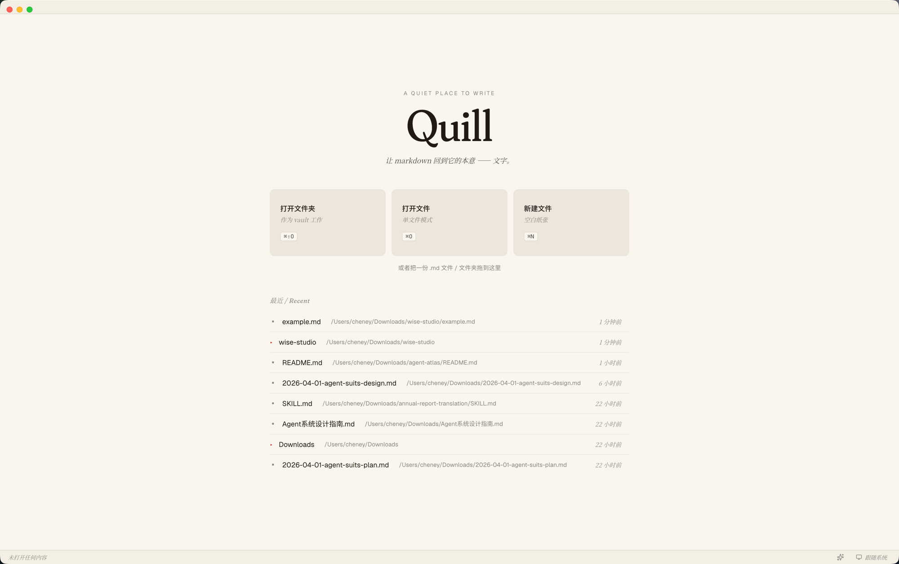
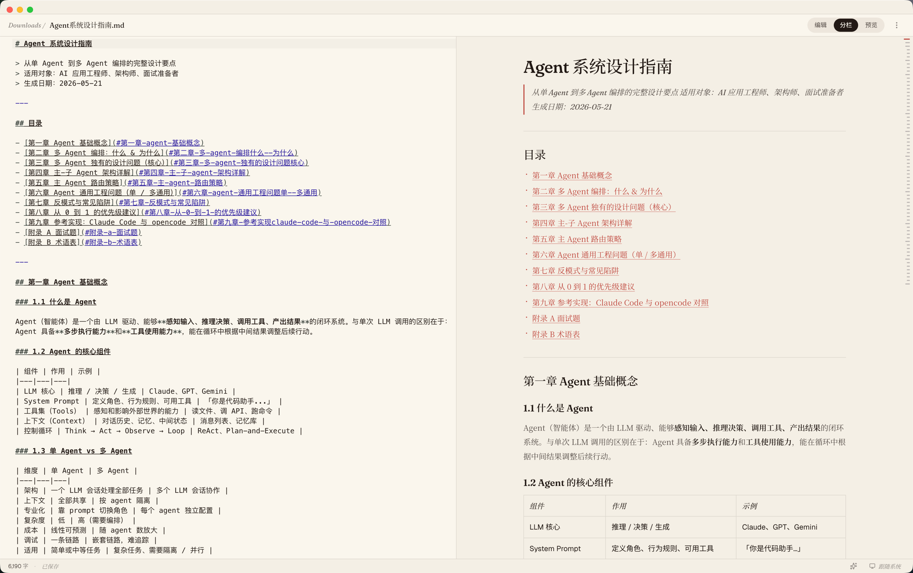
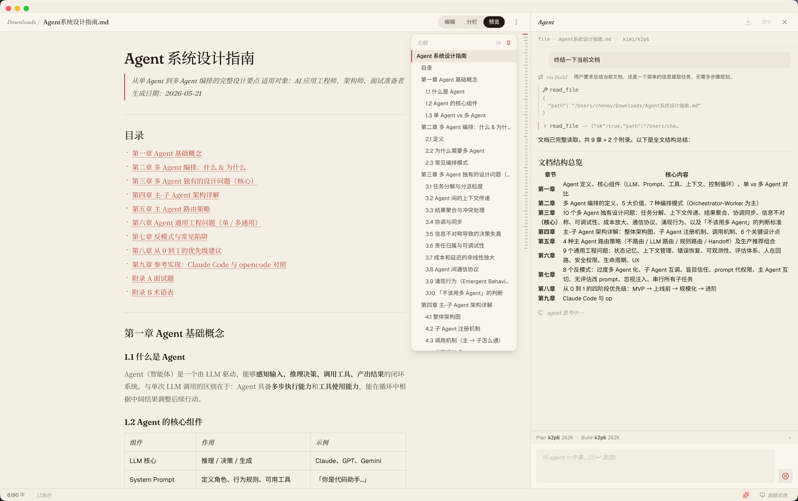

<div align="center">


# Quill

**一款轻量、专注的 Markdown 编辑预览桌面端，带内置 AI Agent。**

Electron · React 18 · TypeScript · Bun · Tailwind v4 · CodeMirror 6

</div>



---

## 简介

Quill 是一个面向写作者与开发者的本地 Markdown 编辑器，目标是把"打开就写、所见即所得的预览、零负担的本地文件管理"这件事做扎实，并提供一个**可控、可见、可中止**的 AI Agent 来辅助写作与编辑。

设计哲学：
- **本地优先**：你的笔记就是你硬盘上的 `.md` 文件，没有云端账号、没有专有格式。
- **少即是多**：先把核心写作体验做到位，不堆砌一次都不会用的功能。
- **AI 是助手不是主角**：Agent 一切动作（读、写、删、计划）都用户可见、可批准、可取消；上下文压缩、模型选择、工具范围都在面板里直接管理。
- **可扩展骨架**：编辑器 / 解析器 / 主题 / IPC 都做成可替换层，方便未来演进。

### 主要特性

**编辑与阅读**
- **双模式工作流** — Workspace（打开文件夹）与 Single-file（双击 / 拖入单文件）两种入口，按场景自适应布局
- **三态视图** — 纯编辑 / 分栏 / 纯预览，一键切换；默认分栏，每次打开新文件回归分栏
- **大纲面板** — 实时跟随光标定位，长文档随手跳章节
- **CodeMirror 6 编辑器** — 内置 `lang-markdown`、查找替换、主题切换
- **markdown-it + highlight.js 预览** — 代码块语法高亮，Tailwind Typography 排版

**AI Agent**
- **Plan / Build / Router 三角** — Router 自动判别复杂任务走 Plan→Build，简单任务直跑 Build；可用 `/plan` `/build` 斜杠强制
- **写工具带审批** — `write_file` / `apply_edit` / `create_file` 每次执行前弹卡片确认，diff 可视；拒绝 = tool error，agent 不会偷偷重试
- **Web fetch 工具** — agent 看到链接自动抓内容；私网 / loopback / 非 http(s) 由 SSRF guard 拒绝
- **每会话独立模型** — 输入框上方可分别为 Plan 和 Build 选 provider/model，带上下文窗大小提示
- **90% 自动压缩** — 上下文接近窗口上限时自动调用压缩 agent 摘要历史，UI 显示"压缩中…"
- **跨 session 持久化** — 对话存 `~/.quill/contexts/<sha256>.json`，重启 Quill 自动恢复（含工具调用 / approval / Plan 痕迹）
- **导出对话** — 一键把对话导成 markdown 笔记

**系统**
- **多窗口** — 每个文件 / 文件夹独立窗口；最后一个窗口关闭时退出
- **macOS 原生集成** — 隐藏式标题栏、`.md` 文件关联、Finder「打开方式」可选
- **Light / Dark / 跟随系统** — 全程基于 CSS 变量，主题切换无闪烁
- **API key 加密存储** — 走系统 keychain (macOS Keychain / Windows DPAPI)，不写明文

---

## 截图

### 编辑 + 预览 + 大纲



### Agent 协作中



> 当前阶段：核心编辑预览 + AI Agent 已落地，按 [docs/ui-design.md](docs/ui-design.md) 的 Roadmap 持续推进。

---

## 技术栈

| 层 | 选型 |
|----|------|
| 桌面运行时 | [Electron](https://www.electronjs.org/) 33 |
| UI | [React](https://react.dev/) 18 + [TypeScript](https://www.typescriptlang.org/) 5 |
| 构建 | [electron-vite](https://electron-vite.org/)（统一驱动 main / preload / renderer） |
| 包管理 / 测试 | [Bun](https://bun.sh/) 1.3+（workspace + `bun:test`） |
| 样式 | [Tailwind CSS v4](https://tailwindcss.com/) + `@tailwindcss/typography` |
| 编辑器 | [CodeMirror 6](https://codemirror.net/) |
| Markdown 渲染 | [markdown-it](https://github.com/markdown-it/markdown-it) + [highlight.js](https://highlightjs.org/) |
| 打包 | [electron-builder](https://www.electron.build/)（macOS arm64 dmg 优先） |

---

## 开发

### 环境要求

- macOS（Windows / Linux 未做主力适配，但应可跑）
- [Bun](https://bun.sh/) **≥ 1.3.6**
- Node 不强依赖；electron-builder 部分原生构建工具仍走系统 toolchain

### 启动开发

```bash
git clone https://github.com/HanchenZhou/quill.git
cd quill
bun install
bun run dev:desktop
```

`bun run dev:desktop` 会通过 `electron-vite dev` 同时启动 main / preload / renderer 三个进程的 HMR，几秒后桌面端窗口会弹出。

首次试用：在空状态面板点 **「打开文件夹」**，选仓库根的 `sample-vault/`，即可体验完整的 Workspace 模式。

### 常用命令

```bash
bun run dev:desktop          # 启动开发（带 HMR）
bun run build:desktop        # 构建到 apps/desktop/out
bun typecheck                # 全 workspace TypeScript 类型检查
bun test                     # 跑测试（bun:test）
```

### 打包安装包

```bash
bun run dist:desktop                    # 默认平台
bun --filter @quill/desktop dist:mac:arm64   # macOS Apple Silicon dmg
bun --filter @quill/desktop dist:mac         # macOS（含 universal）
bun --filter @quill/desktop dist:win         # Windows
bun --filter @quill/desktop dist:linux       # Linux
```

产物在 `apps/desktop/release/<version>/`。改了 `apps/desktop/build/icon.svg` 后用 `bun --filter @quill/desktop icon` 重新生成 `.icns`。

### 测试

测试文件与源码同目录、同名加 `.test.ts` 后缀；不另开 `tests/` 目录。所有 `apps/` 与 `packages/` 下的逻辑改动遵循 TDD 红 - 绿 - 重构循环，详见 [`.claude/skills/tdd/SKILL.md`](.claude/skills/tdd/SKILL.md)。

```bash
bun test                                # 全量
bun test apps/desktop/src/renderer      # 指定目录
```

---

## 项目结构

```
quill/
├── apps/
│   └── desktop/                Electron 桌面端
│       ├── src/main/             主进程：窗口、IPC、菜单、文件 dialog、PDF 导出
│       ├── src/preload/          contextBridge 暴露受控 API（命名空间 window.quill）
│       └── src/renderer/         React + Tailwind UI
├── packages/                   workspace 共享包（预留）
├── docs/
│   ├── architecture.md           工程结构与进程模型
│   └── ui-design.md              v0 UI 结构与交互
├── sample-vault/               首次试用用的示例笔记
└── tsconfig.base.json
```

进程模型遵循 Electron 安全默认：`contextIsolation: true`、`sandbox: true`、`nodeIntegration: false`。Renderer 不直接访问 Node API，所有特权能力都经 preload + IPC。

---

## 文档

- **[docs/architecture.md](docs/architecture.md)** — 工程结构、进程模型、构建产物、未决问题
- **[docs/ui-design.md](docs/ui-design.md)** — 双模式布局、视图状态、组件细节、Roadmap
- **[CLAUDE.md](CLAUDE.md)** — 协作 Claude Code 时的项目约定（TDD、Git 工作流、技术栈）

---

## 贡献

外部贡献者：fork 后开 PR；main 分支受保护，任何变更都需经 PR + 审核合入。提交规范走 [Conventional Commits](https://www.conventionalcommits.org/)（`<type>(<scope>): <subject>`），分支命名 `<type>/<issue-number>-<slug>`。

---

## 状态

早期阶段（v0）— 仍在频繁变动，API / 目录 / 配置都可能调整。欢迎试用、提 issue 与建议。
